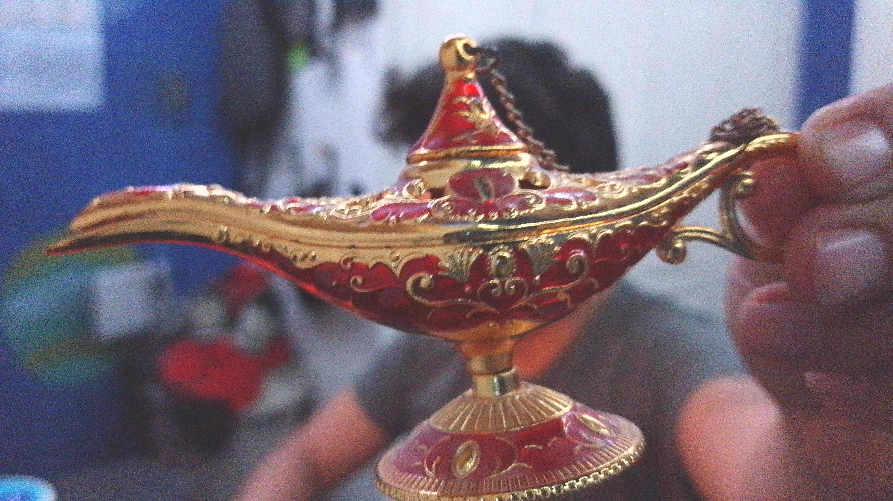
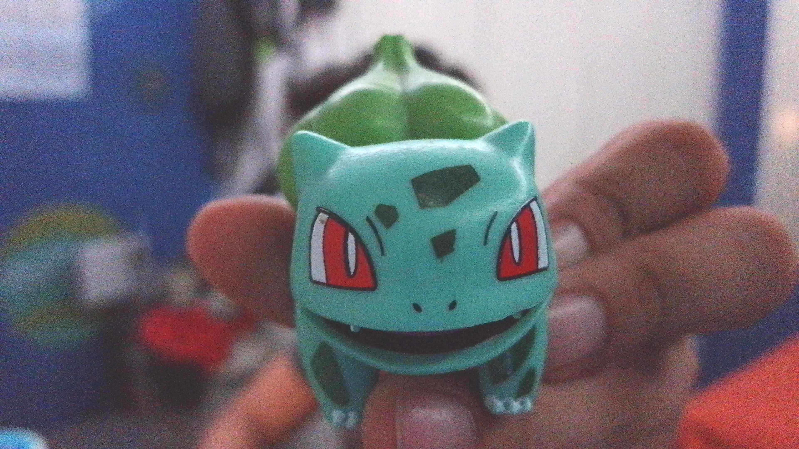
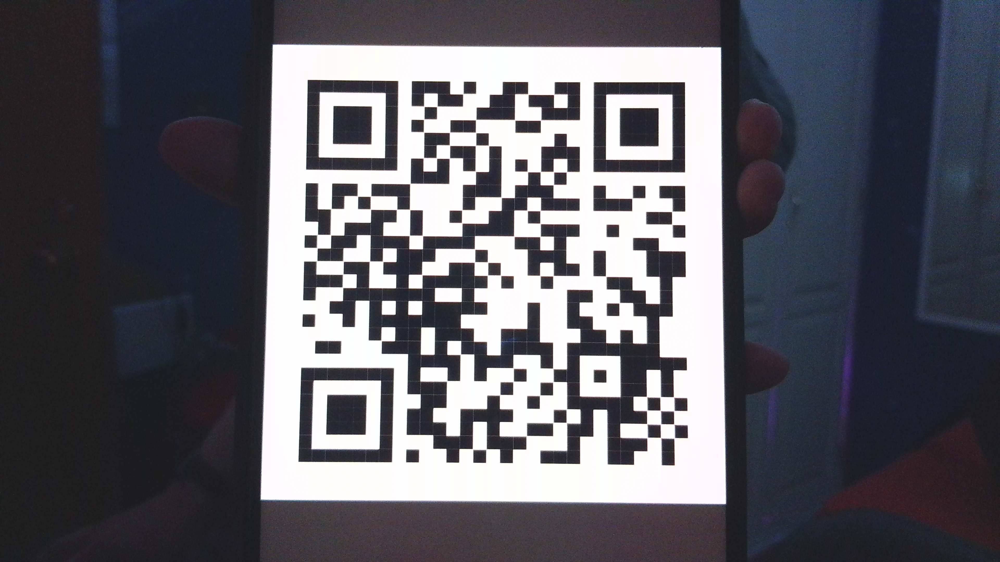
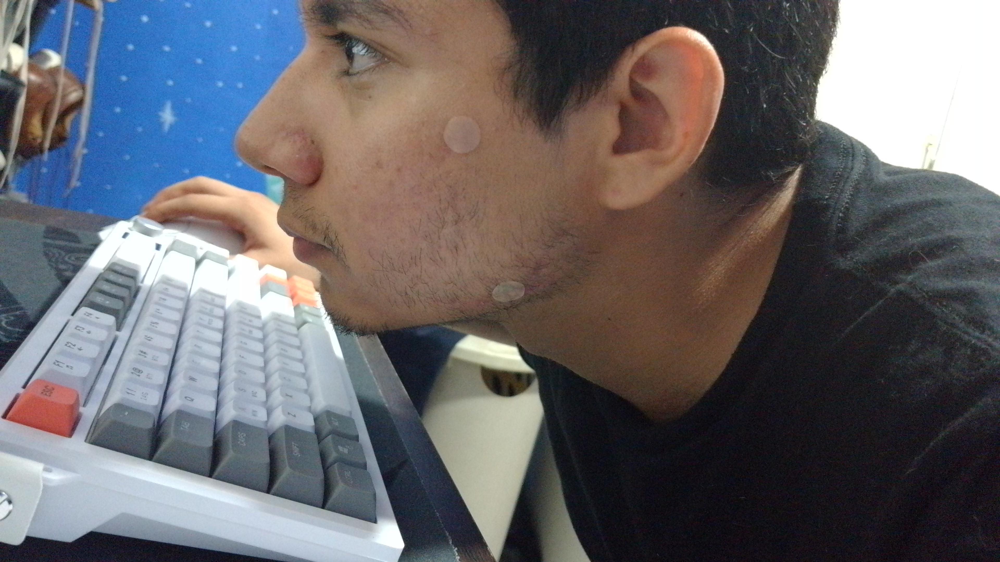
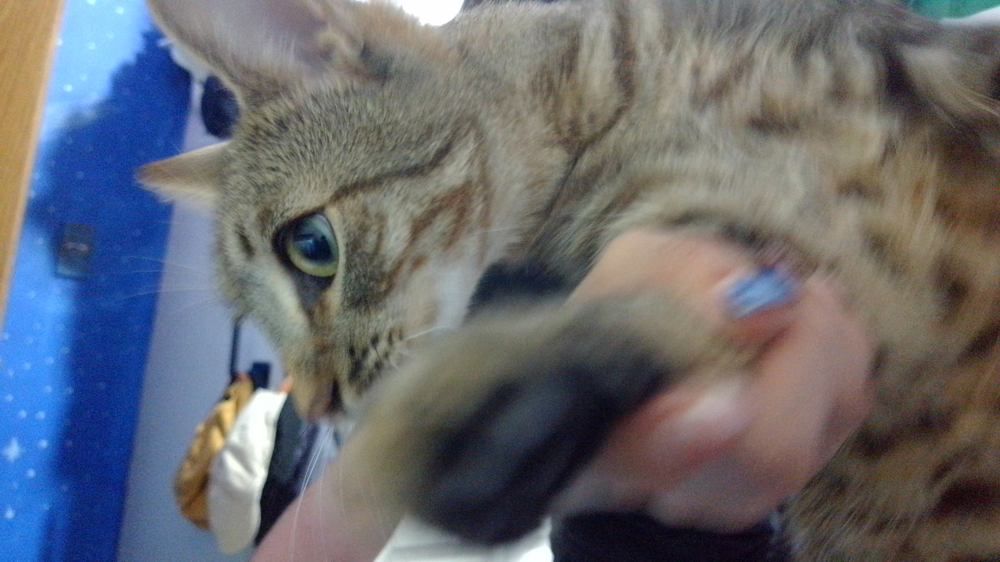
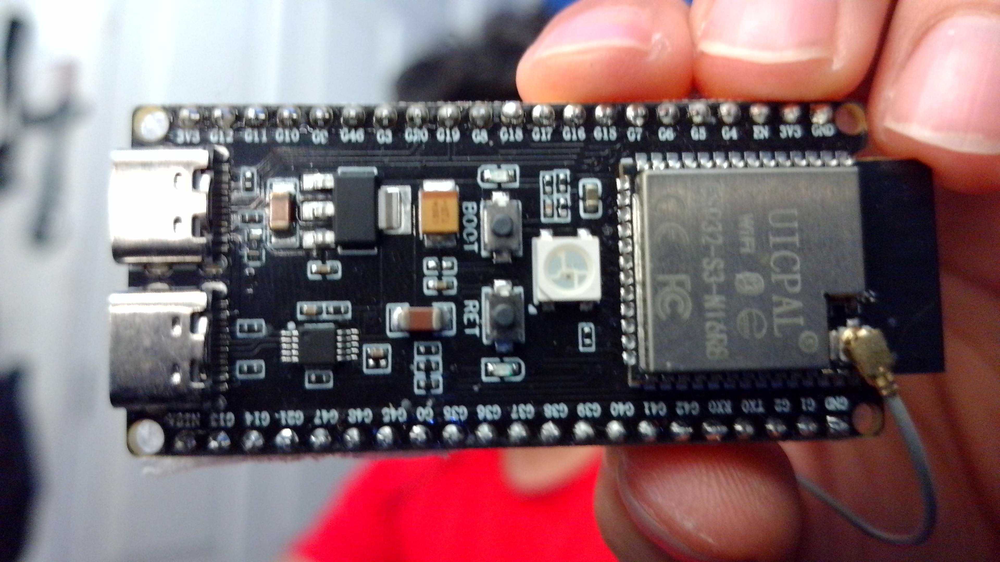
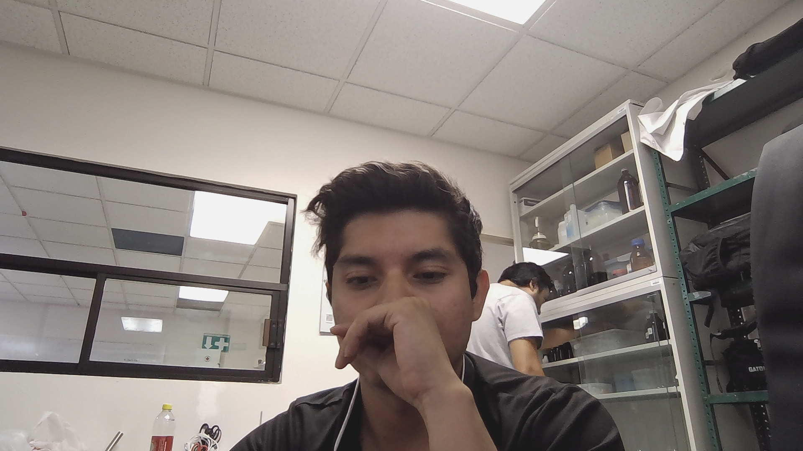
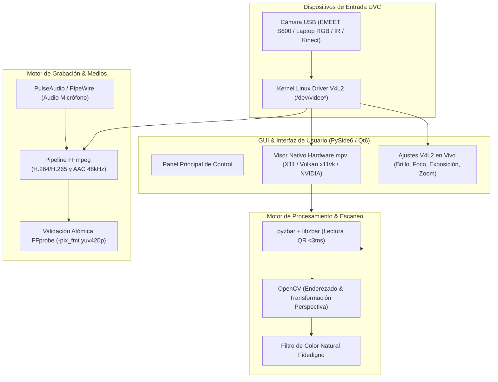

# B.I.O.R. Cam v2.12.1 — Control, Grabación y Escaneo UVC Acelerado en Linux

[](https://doi.org/10.5281/zenodo.21304061)

Aplicación profesional de control, grabación y escaneo inteligente para cámaras UVC en Linux, optimizada para la **EMEET SmartCam S600**, cámaras integradas RGB/IR de laptops (como ASUS ROG G16 / Bazzite) y placas ARM64 como la **Orange Pi 5 Max (RK3588)**.

Ofrece renderizado directo acelerado por hardware GPU (Vulkan/x11vk/NVIDIA), decodificación NPU en Rockchip (RKNN), soporte opcional para Xbox 360 Kinect y empaquetado autónomo en **AppImage**.

---

## 📸 Demostración Visual y Galería de Pruebas

| Interfaz Principal de la Aplicación | Visor en Vivo y Panel de Control |
|:----------------------------------:|:--------------------------------:|
|  |  |

| Captura de Alta Definición | Detección y Prueba de Cámara |
|:-------------------------:|:----------------------------:|
|  |  |

| Evaluación de Renderizado Nítido | Prueba de Enfoque y Exposición |
|:-------------------------------:|:------------------------------:|
|  |  |

| Muestra de Fotografía Capturada |
|:-------------------------------:|
|  |

---

## 🚀 Novedades de la Versión v2.12.1

- **⚡ Modo QR a 60 FPS Estilo Nativo (GPU Vulkan):**
  - El visor de cámara nativo `mpv` se mantiene **100% activo en hardware GPU a 60 FPS**, omitiendo lienzos de software CPU que causaban tirones.
  - Priorización del motor `pyzbar` que decodifica códigos QR en **menos de 3 milisegundos**.
  - Eliminación de cuadros flotantes oscuros molestos; la información aparece en la tarjeta lateral (**✓ Código QR**, **Copiar**, **Abrir URL**, **Guardar QR**) con notificaciones limpias.
  - Pausa automática de capturas tras la detección para evitar saturar la tubería GPU.

- **📄 Escáner de Documentos Fidedigno (Color Natural Real):**
  - Configurado predeterminadamente en modo **«🎨 Color natural (Fidedigno)»**, conservando el 100% de los colores y detalles originales capturados por el sensor sin blanquear las imágenes.
  - Botón **«📸 Capturar página»** siempre disponible y habilitado. Si la escena no tiene 4 esquinas marcadas, captura automáticamente la escena completa en alta definición.
  - Mantiene la vista en vivo GPU fluida a 60 FPS sin degradar la resolución.

- **🎞️ Compatibilidad Universal MP4 (YUV 4:2:0):**
  - Inclusión obligatoria de `-pix_fmt yuv420p` y tag `avc1`/`hvc1` en la codificación H.264/H.265.
  - Garantiza reproducción perfecta en **100% de los reproductores** (GNOME Videos, VLC, celulares Android/iOS, navegadores web y smart TVs).

- **🔍 Arranque Fiable en Máxima Resolución (1080p / 4K):**
  - Forzado del primer modo nativo de máxima resolución disponible al iniciar.
  - Verificación activa de stream (`_verify_startup_video`) a los 2.5s con autorrecuperación en 3 reintentos para cámaras USB lentas en inicializar (como la EMEET S600).

- **📂 Gestión Automatizada de Carpetas:**
  - Los botones **🖼 Fotos** y **🎬 Vídeos** aseguran la creación automática de las carpetas de destino (`~/Imágenes/Camera/` y `~/Vídeos/Camera/`) antes de abrir el explorador de archivos.

---

## 🏗️ Arquitectura del Sistema



---

## 💻 Ejecución y Desarrollo

- **Orange Pi 5 / RK3588:** `dist/Biro-Cam-aarch64.AppImage`
- **PC / Bazzite / Fedora / Ubuntu:** `dist/Biro-Cam-x86_64.AppImage`
- **Instalador de Menú GNOME:**
  ```bash
  bash packaging/install_desktop.sh
  ```
- **Entorno de Desarrollo Python:**
  ```bash
  python3 camara_s600.py
  ```

---

## ✨ Características Principales

- **Visor en Vivo Hardware:** Renderizado empotrado con `mpv` mediante socket IPC (`/tmp/mpv-biro-cam.sock`).
- **6 Guías de Encuadre:** Tercios, Proporción áurea, Espiral (Fibonacci), Cruz centrada, Diagonales.
- **Grabación Acelerada:** Bitrate configurable (1–50 Mbps), duración límite, códecs H.264/H.265.
- **Validación Atómica MP4:** Grabación temporal en MKV + WAV, validada con `ffprobe` antes de publicar.
- **Modo Seguridad:** Detección de movimiento por OpenCV, grabación automática y overlay HUD profesional.
- **Inferencia NPU (RK3588):** Detección de personas con YOLOv5 en NPU Rockchip (~43 ms) con fallback CPU.
- **Soporte Kinect Xbox 360:** Modos RGB, IR, profundidad, inclinación y LED.
- **Atajos de Teclado:**
  - `Espacio` / `S`: Tomar Foto
  - `R`: Iniciar / Detener Grabación
  - `Q`: Activar / Desactivar Modo QR
  - `E`: Activar / Desactivar Escáner de Documentos
  - `C`: Capturar Página
  - `G`: Abrir Carpeta de Fotos
  - `V`: Abrir Carpeta de Vídeos
  - `F11`: Pantalla Completa
  - `Esc`: Salir de modos especiales

---

## 📦 Empaquetado AppImage

Construcción del binario autónomo para Linux:
```bash
ENV_NAME=biro-cam-build-x86 REUSE_APPDIR=1 bash packaging/build_appimage.sh
```

El script detecta la arquitectura (`x86_64` o `aarch64`), bundlea Qt6, PySide6, OpenCV, `libzbar` y genera la AppImage lista para distribuir.

---

## 🎯 Estructura de Guardado de Archivos

| Tipo de Contenido | Carpeta de Destino |
|:-----------------|:-------------------|
| **Fotos Normales** | `~/Imágenes/Camera/` |
| **Escaneos de Documentos** | `~/Imágenes/Camera/Escaner/` |
| **Fotografías de Códigos QR** | `~/Imágenes/Camera/QR/` |
| **Vídeos Grabados (MP4)** | `~/Vídeos/Camera/` |

---

## 🧠 Justificación Técnica

Las aplicaciones predeterminadas en Linux (como **Cheese** o **GNOME Snapshot**) suelen fallar o congelarse al usar webcams 4K de alta velocidad (como la EMEET S600) en placas ARM64 como la **Orange Pi 5 Max (RK3588)** debido a dos factores:

1. **Saturación del bus USB por formato YUV:** Cheese y Snapshot intentan solicitar transmisiones de vídeo sin comprimir en formato **YUYV (YUV 4:2:2)**. A resoluciones altas como 1080p a 60 fps o 4K a 30 fps, el flujo raw excede el ancho de banda físico del bus USB. La cámara requiere la transmisión comprimida **MJPEG**.
2. **Cuelgues del Kernel (Bug de RGA >4GB):** Al intentar decodificar por hardware mediante GStreamer (`rockchipmpp`), se delega el procesamiento al motor RGA de Rockchip. Dado que el RGA posee una MMU de 32 bits limitada a 4 GB, en sistemas con 16 GB de RAM el mapeo de memoria se corrompe, provocando un *kernel panic*.

**B.I.O.R. Cam** resuelve esto de forma idónea:
- Fuerza el flujo comprimido **MJPEG** de alta velocidad.
- Delega la visualización en vivo a **mpv** mediante decodificación por software (`--hwdec=no`), eludiendo por completo el motor RGA del RK3588 y garantizando estabilidad absoluta en el kernel.
- Controla los parámetros de hardware directamente vía `v4l2-ctl`.
- Reserva el codificador físico (`h264_rkmpp` / `hevc_rkmpp` o `libx264`) exclusivamente para la compresión final en segundo plano.
